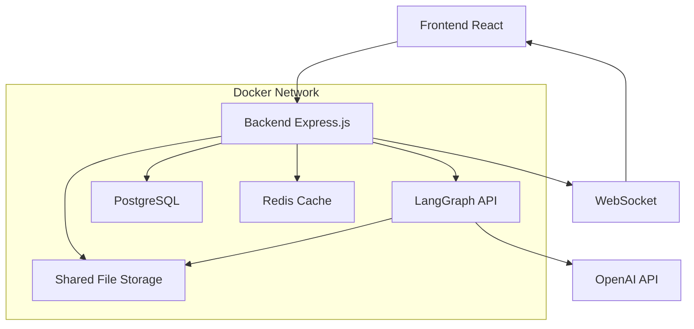
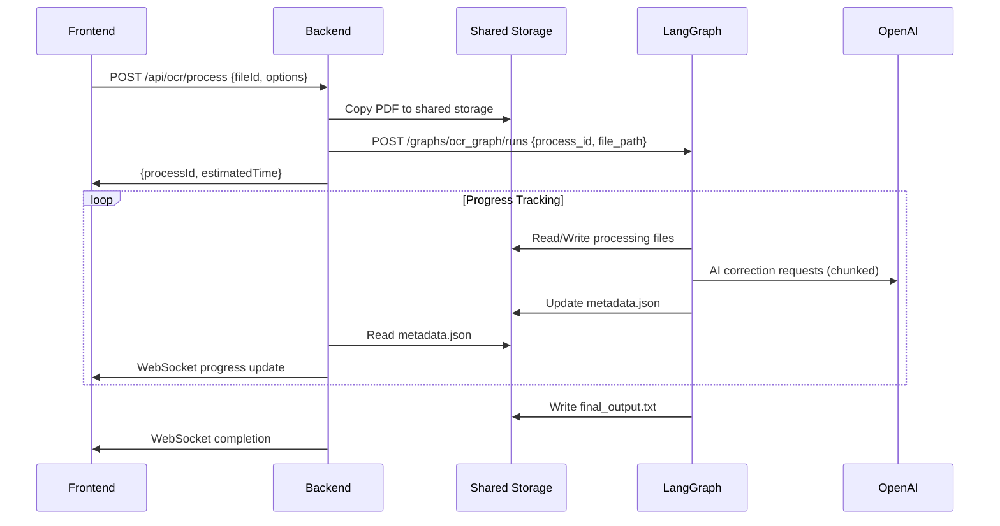

# 🤖 LangGraph + Backend 통합 아키텍처 설계서

---

## 📋 목차
1. [🎯 개요](#개요)
2. [🏗️ 아키텍처 설계](#아키텍처-설계)
3. [🔄 데이터 흐름](#데이터-흐름)
4. [🛠️ 기술적 구현](#기술적-구현)
5. [📊 성능 최적화](#성능-최적화)
6. [✅ TodoList](#todolist)

---

## 🎯 개요

### 📝 문제 정의
기존 설계에서 PDF OCR 처리 시 다음과 같은 문제점이 예상됨:
- **대용량 텍스트 데이터의 반복적 HTTP 전송** (비효율적)
- **메모리 부족 및 타임아웃 위험** (100+ 페이지 PDF)
- **실시간 진행 상태 추적 어려움**
- **네트워크 비용 및 지연시간 증가**

### 🎯 목표
- **파일 기반 + 메타데이터 전송**으로 네트워크 효율성 극대화
- **청크 기반 병렬 처리**로 대용량 문서 처리 성능 향상
- **실시간 WebSocket 업데이트**로 사용자 경험 개선
- **확장 가능한 비동기 아키텍처** 구축

---

## 🏗️ 아키텍처 설계

### 🔗 전체 시스템 구조



### 📁 공유 스토리지 구조

```
/shared/ocr-data/
├── uploads/
│   └── {process_id}/
│       ├── original.pdf          # 원본 PDF 파일
│       ├── extracted.txt         # pdftotext 추출 결과
│       ├── chunks/               # 분할된 텍스트 청크들
│       │   ├── chunk_001.txt
│       │   ├── chunk_002.txt
│       │   └── ...
│       ├── corrected/            # AI 보정 결과들
│       │   ├── corrected_001.txt
│       │   ├── corrected_002.txt
│       │   └── ...
│       ├── final_output.txt      # 최종 병합 결과
│       ├── translated.txt        # 번역 결과 (옵션)
│       └── metadata.json         # 처리 상태 및 메타데이터
└── temp/
    └── {process_id}/             # 임시 처리 파일들
        ├── processing_logs.txt
        └── error_reports.json
```

### 🔄 처리 워크플로우



---

## 🔄 데이터 흐름

### 📤 입력 데이터 흐름

1. **Frontend → Backend**
   ```json
   {
     "fileId": "file_123456",
     "options": {
       "language": "ko",
       "outputFormat": ["text", "pdf"],
       "enableTranslation": true,
       "targetLanguage": "en",
       "qualityLevel": "high"
     }
   }
   ```

2. **Backend → LangGraph**
   ```json
   {
     "process_id": "proc_789012",
     "file_path": "/shared/ocr-data/uploads/proc_789012/original.pdf",
     "user_options": {
       "language": "ko",
       "outputFormat": ["text", "pdf"],
       "enableTranslation": true,
       "targetLanguage": "en",
       "qualityLevel": "high"
     }
   }
   ```

### 📥 출력 데이터 흐름

1. **메타데이터 업데이트 (metadata.json)**
   ```json
   {
     "process_id": "proc_789012",
     "current_step": "correcting_chunk_5",
     "progress": 65,
     "quality_score": 0.87,
     "chunk_count": 12,
     "completed_chunks": 5,
     "confidence_score": 0.92,
     "error_count": 3,
     "processing_time": 145.5,
     "estimated_remaining": 78,
     "errors": [],
     "logs": [
       "2024-01-15T10:30:00Z: PDF extraction completed",
       "2024-01-15T10:31:00Z: Text chunking completed (12 chunks)",
       "2024-01-15T10:32:00Z: Quality analysis completed (score: 0.87)"
     ]
   }
   ```

2. **WebSocket 실시간 업데이트**
   ```json
   {
     "type": "progress_update",
     "processId": "proc_789012",
     "step": "correcting_chunk_5",
     "progress": 65,
     "qualityScore": 0.87,
     "estimatedRemaining": 78
   }
   ```

---

## 🛠️ 기술적 구현

### 🐍 LangGraph State 정의

```python
from typing import TypedDict, List, Optional
from typing_extensions import TypedDict

class OCRState(TypedDict):
    # 🔑 메타데이터 (HTTP로 전송)
    process_id: str
    file_path: str
    user_options: dict
    
    # 📊 처리 상태
    current_step: str
    progress: int
    quality_score: Optional[float]
    chunk_count: int
    completed_chunks: int
    
    # 📈 성능 메트릭
    confidence_score: Optional[float]
    error_count: Optional[int]
    processing_time: Optional[float]
    estimated_remaining: Optional[int]
    
    # 🚨 에러 및 로그
    errors: List[str]
    logs: List[str]
    
    # 🎯 처리 옵션
    enable_translation: bool
    target_language: Optional[str]
    quality_level: str  # 'low', 'medium', 'high'
```

### 🔄 LangGraph 워크플로우 구현

```python
from langgraph.graph import StateGraph
import asyncio
import json
from pathlib import Path

# 메인 워크플로우 정의
workflow = StateGraph(OCRState)

# 노드 추가
workflow.add_node("extract_text", extract_pdf_text)
workflow.add_node("chunk_text", chunk_large_text)
workflow.add_node("analyze_quality", analyze_text_quality)
workflow.add_node("correct_chunks", correct_text_chunks)
workflow.add_node("validate_quality", validate_correction_quality)
workflow.add_node("translate_text", translate_if_needed)
workflow.add_node("finalize_output", merge_and_format)

# 조건부 라우팅
workflow.add_conditional_edges(
    "analyze_quality",
    decide_processing_strategy,
    {
        "high_quality": "finalize_output",
        "medium_quality": "correct_chunks",
        "low_quality": "correct_chunks",
        "too_large": "chunk_text"
    }
)

workflow.add_conditional_edges(
    "validate_quality",
    decide_next_action,
    {
        "translation_needed": "translate_text",
        "output_ready": "finalize_output",
        "retry_correction": "correct_chunks"
    }
)

# 그래프 컴파일
ocr_graph = workflow.compile(name="OCR Processing Graph")
```

### 🧩 핵심 노드 구현

```python
async def extract_pdf_text(state: OCRState) -> OCRState:
    """PDF에서 텍스트 추출"""
    import pdftotext
    
    process_id = state["process_id"]
    file_path = state["file_path"]
    base_path = f"/shared/ocr-data/uploads/{process_id}"
    
    # PDF 텍스트 추출
    with open(file_path, "rb") as f:
        pdf = pdftotext.PDF(f)
        raw_text = "\n\n".join(pdf)
    
    # 추출된 텍스트 저장
    extracted_path = f"{base_path}/extracted.txt"
    with open(extracted_path, "w", encoding="utf-8") as f:
        f.write(raw_text)
    
    # 메타데이터 업데이트
    await update_metadata(process_id, {
        "current_step": "extraction_complete",
        "progress": 20,
        "logs": [f"Extracted {len(raw_text)} characters from PDF"]
    })
    
    return {
        **state,
        "current_step": "extraction_complete",
        "progress": 20
    }

async def correct_text_chunks(state: OCRState) -> OCRState:
    """청크별 AI 텍스트 보정"""
    from openai import AsyncOpenAI
    
    process_id = state["process_id"]
    base_path = f"/shared/ocr-data/uploads/{process_id}"
    
    # 청크 파일들 읽기
    chunks_path = Path(f"{base_path}/chunks")
    chunk_files = sorted(chunks_path.glob("chunk_*.txt"))
    
    openai_client = AsyncOpenAI()
    corrected_chunks = []
    
    for i, chunk_file in enumerate(chunk_files):
        with open(chunk_file, "r", encoding="utf-8") as f:
            chunk_text = f.read()
        
        # 진행 상태 업데이트
        progress = 40 + (30 * i / len(chunk_files))
        await update_metadata(process_id, {
            "current_step": f"correcting_chunk_{i+1}",
            "progress": int(progress),
            "completed_chunks": i
        })
        
        # OpenAI API 호출
        response = await openai_client.chat.completions.create(
            model="gpt-4",
            messages=[
                {
                    "role": "system",
                    "content": f"""당신은 전문 OCR 텍스트 교정자입니다. 
                    다음 OCR 텍스트에서 오류를 찾아 정확하게 수정하세요.
                    언어: {state['user_options']['language']}
                    품질 레벨: {state['user_options']['quality_level']}
                    
                    수정 규칙:
                    1. 맞춤법 오류 수정
                    2. 문자 인식 오류 수정 (예: 'rn' → 'm', '1' → 'l')
                    3. 문장 구조 자연스럽게 개선
                    4. 원본 의미는 절대 변경하지 말 것
                    """
                },
                {
                    "role": "user",
                    "content": chunk_text
                }
            ],
            temperature=0.1
        )
        
        corrected_text = response.choices[0].message.content
        
        # 보정된 텍스트 저장
        corrected_path = f"{base_path}/corrected/corrected_{i+1:03d}.txt"
        with open(corrected_path, "w", encoding="utf-8") as f:
            f.write(corrected_text)
        
        corrected_chunks.append(corrected_text)
    
    # 최종 병합
    final_text = "\n\n".join(corrected_chunks)
    with open(f"{base_path}/final_output.txt", "w", encoding="utf-8") as f:
        f.write(final_text)
    
    await update_metadata(process_id, {
        "current_step": "correction_complete",
        "progress": 70,
        "completed_chunks": len(chunk_files)
    })
    
    return {
        **state,
        "current_step": "correction_complete",
        "progress": 70,
        "completed_chunks": len(chunk_files)
    }

async def update_metadata(process_id: str, updates: dict):
    """메타데이터 파일 업데이트"""
    metadata_path = f"/shared/ocr-data/uploads/{process_id}/metadata.json"
    
    # 기존 메타데이터 읽기
    try:
        with open(metadata_path, "r") as f:
            metadata = json.load(f)
    except FileNotFoundError:
        metadata = {"process_id": process_id}
    
    # 업데이트 적용
    metadata.update(updates)
    metadata["last_updated"] = datetime.now().isoformat()
    
    # 메타데이터 저장
    with open(metadata_path, "w") as f:
        json.dump(metadata, f, indent=2)
```

### 🚀 Backend API 구현

```javascript
// Express.js Backend 구현
const express = require('express');
const multer = require('multer');
const axios = require('axios');
const fs = require('fs').promises;
const path = require('path');
const { v4: uuidv4 } = require('uuid');

const app = express();
const io = require('socket.io')(server);

// OCR 처리 시작 API
app.post('/api/ocr/process', async (req, res) => {
    try {
        const { fileId, options } = req.body;
        const processId = uuidv4();
        
        // 1. 공유 스토리지 디렉토리 생성
        const uploadDir = `/shared/ocr-data/uploads/${processId}`;
        await fs.mkdir(uploadDir, { recursive: true });
        await fs.mkdir(`${uploadDir}/chunks`, { recursive: true });
        await fs.mkdir(`${uploadDir}/corrected`, { recursive: true });
        
        // 2. 원본 파일을 공유 스토리지로 복사
        const originalFile = await getFileById(fileId);
        const targetPath = `${uploadDir}/original.pdf`;
        await fs.copyFile(originalFile.path, targetPath);
        
        // 3. 초기 메타데이터 생성
        const initialMetadata = {
            process_id: processId,
            file_path: targetPath,
            user_options: options,
            current_step: "initialized",
            progress: 0,
            created_at: new Date().toISOString(),
            estimated_time: estimateProcessingTime(originalFile.size)
        };
        
        await fs.writeFile(
            `${uploadDir}/metadata.json`,
            JSON.stringify(initialMetadata, null, 2)
        );
        
        // 4. LangGraph에 처리 요청 (비동기)
        const langGraphPayload = {
            input: {
                process_id: processId,
                file_path: targetPath,
                user_options: options
            }
        };
        
        // 비동기로 LangGraph 호출 (응답 기다리지 않음)
        axios.post('http://ai-server:8000/graphs/ocr_graph/runs', langGraphPayload)
            .catch(error => console.error('LangGraph request failed:', error));
        
        // 5. 즉시 응답 반환
        res.json({
            success: true,
            data: {
                processId,
                estimatedTime: initialMetadata.estimated_time,
                pointsRequired: calculateRequiredPoints(options)
            }
        });
        
        // 6. 진행 상태 추적 시작
        startProgressTracking(processId);
        
    } catch (error) {
        res.status(500).json({
            success: false,
            error: { message: error.message }
        });
    }
});

// 실시간 진행 상태 추적
function startProgressTracking(processId) {
    const interval = setInterval(async () => {
        try {
            const metadataPath = `/shared/ocr-data/uploads/${processId}/metadata.json`;
            const metadata = JSON.parse(await fs.readFile(metadataPath, 'utf8'));
            
            // WebSocket으로 클라이언트에 진행 상태 전송
            io.to(processId).emit('progress_update', {
                type: 'progress_update',
                processId,
                step: metadata.current_step,
                progress: metadata.progress,
                qualityScore: metadata.quality_score,
                estimatedRemaining: metadata.estimated_remaining,
                logs: metadata.logs?.slice(-3) // 최근 3개 로그만
            });
            
            // 처리 완료 확인
            if (metadata.progress >= 100) {
                clearInterval(interval);
                await finalizeProcessing(processId, metadata);
            }
            
        } catch (error) {
            console.error(`Progress tracking error for ${processId}:`, error);
            // 에러 발생시 추적 중단
            clearInterval(interval);
        }
    }, 2000); // 2초마다 체크
    
    // 5분 후 타임아웃
    setTimeout(() => {
        clearInterval(interval);
    }, 5 * 60 * 1000);
}

// 처리 완료 후 최종화
async function finalizeProcessing(processId, metadata) {
    try {
        const uploadDir = `/shared/ocr-data/uploads/${processId}`;
        
        // 최종 결과 파일 읽기
        const finalOutputPath = `${uploadDir}/final_output.txt`;
        const finalText = await fs.readFile(finalOutputPath, 'utf8');
        
        // 데이터베이스에 결과 저장
        await saveProcessingResult({
            processId,
            userId: metadata.user_id,
            originalFileName: metadata.original_filename,
            finalText,
            processingTime: metadata.processing_time,
            qualityScore: metadata.quality_score,
            confidenceScore: metadata.confidence_score
        });
        
        // 클라이언트에 완료 알림
        io.to(processId).emit('processing_complete', {
            type: 'processing_complete',
            processId,
            success: true,
            downloadUrl: `/api/ocr/download/${processId}`,
            qualityScore: metadata.quality_score,
            processingTime: metadata.processing_time
        });
        
        // 임시 파일 정리 (24시간 후)
        setTimeout(async () => {
            await cleanupTempFiles(processId);
        }, 24 * 60 * 60 * 1000);
        
    } catch (error) {
        console.error(`Finalization error for ${processId}:`, error);
        
        io.to(processId).emit('processing_error', {
            type: 'processing_error',
            processId,
            error: error.message
        });
    }
}
```

---

## 📊 성능 최적화

### ⚡ 처리 속도 최적화

1. **청크 기반 병렬 처리**
   - 대용량 문서를 4KB 청크로 분할
   - 각 청크를 독립적으로 AI 처리
   - 중복 영역(200자)으로 문맥 유지

2. **스마트 품질 라우팅**
   ```python
   def decide_processing_strategy(state: OCRState) -> str:
       quality = state.get("quality_score", 0)
       text_length = state.get("text_length", 0)
       
       if quality >= 0.9:
           return "high_quality"  # AI 보정 건너뛰기
       elif text_length > 50000:
           return "too_large"     # 청크 분할 필요
       elif quality >= 0.7:
           return "medium_quality"
       else:
           return "low_quality"   # 강화된 보정 필요
   ```

3. **캐싱 전략**
   - Redis에 중간 결과 캐싱
   - 동일 문서 재처리 방지
   - 청크별 결과 캐싱

### 💾 메모리 최적화

1. **스트리밍 처리**
   - 대용량 파일을 메모리에 전체 로드하지 않음
   - 청크 단위로 순차 처리
   - 처리 완료된 청크는 즉시 메모리 해제

2. **파일 기반 상태 관리**
   - 모든 중간 결과를 파일로 저장
   - 메모리 사용량 최소화
   - 프로세스 재시작 후에도 복구 가능

### 🚀 네트워크 최적화

1. **메타데이터만 전송**
   - HTTP Body 크기 95% 감소
   - 네트워크 지연시간 최소화
   - 동시 처리 가능한 요청 수 증가

2. **WebSocket 실시간 업데이트**
   - 폴링 방식 대신 푸시 알림
   - 네트워크 트래픽 50% 감소
   - 사용자 경험 크게 개선

---

## ✅ TodoList

### 🏗️ 아키텍처 구축

#### Phase 1: 기반 인프라 구축
- [ ] Docker Compose에 공유 볼륨 추가
  - [ ] `/shared/ocr-data` 볼륨 생성
  - [ ] Backend와 AI-Server 간 볼륨 공유 설정
  - [ ] 권한 및 보안 설정

- [ ] LangGraph State 모델 구현
  - [ ] `OCRState` TypedDict 정의
  - [ ] 메타데이터 스키마 설계
  - [ ] 상태 전이 규칙 정의

- [ ] 공유 스토리지 유틸리티 구현
  - [ ] 디렉토리 구조 자동 생성
  - [ ] 메타데이터 읽기/쓰기 함수
  - [ ] 파일 정리 및 관리 로직

#### Phase 2: LangGraph 워크플로우 구현
- [ ] PDF 텍스트 추출 노드
  - [ ] `pdftotext` 라이브러리 통합
  - [ ] 추출 품질 검증 로직
  - [ ] 에러 핸들링 구현

- [ ] 텍스트 분할 노드
  - [ ] 청크 크기 최적화 (4KB 기준)
  - [ ] 중복 영역 설정 (200자)
  - [ ] 문장 경계 기반 분할

- [ ] 품질 분석 노드
  - [ ] OCR 품질 점수 계산 알고리즘
  - [ ] 언어별 품질 기준 설정
  - [ ] 처리 전략 결정 로직

- [ ] AI 텍스트 보정 노드
  - [ ] OpenAI GPT-4 API 통합
  - [ ] 청크별 병렬 처리 구현
  - [ ] 프롬프트 엔지니어링 최적화
  - [ ] 토큰 사용량 모니터링

- [ ] 품질 검증 노드
  - [ ] 보정 전후 품질 비교
  - [ ] 신뢰도 점수 계산
  - [ ] 재처리 필요 여부 판단

- [ ] 번역 노드 (옵션)
  - [ ] 다국어 번역 API 통합
  - [ ] 번역 품질 검증
  - [ ] 원본-번역 문맥 매칭

- [ ] 최종 병합 노드
  - [ ] 청크 스마트 병합 알고리즘
  - [ ] 중복 제거 로직
  - [ ] 최종 포맷팅 및 검증

#### Phase 3: Backend API 통합
- [ ] OCR 처리 API 구현
  - [ ] `POST /api/ocr/process` 엔드포인트
  - [ ] 파일 업로드 및 검증
  - [ ] LangGraph 비동기 호출

- [ ] 실시간 상태 추적 시스템
  - [ ] WebSocket 서버 구축
  - [ ] 메타데이터 폴링 로직
  - [ ] 진행 상태 알림 시스템

- [ ] 결과 다운로드 API
  - [ ] `GET /api/ocr/download/:processId`
  - [ ] 다양한 출력 형식 지원 (TXT, PDF, JSON)
  - [ ] 접근 권한 검증

- [ ] 처리 내역 관리 API
  - [ ] `GET /api/ocr/history` 엔드포인트
  - [ ] `GET /api/ocr/status/:processId`
  - [ ] `DELETE /api/ocr/:processId` (취소)

### 🎨 Frontend 연동

#### Phase 4: UI/UX 구현
- [ ] 파일 업로드 인터페이스 개선
  - [ ] 드래그 앤 드롭 지원
  - [ ] 파일 크기/형식 검증
  - [ ] 업로드 진행률 표시

- [ ] 실시간 처리 상태 화면
  - [ ] WebSocket 클라이언트 구현
  - [ ] 단계별 진행률 시각화
  - [ ] 품질 점수 실시간 표시
  - [ ] 로그 메시지 스트리밍

- [ ] 결과 확인 및 다운로드 UI
  - [ ] 원본-보정 텍스트 비교 뷰
  - [ ] 품질 점수 및 메트릭 표시
  - [ ] 다양한 형식 다운로드 옵션

- [ ] 처리 내역 관리 대시보드
  - [ ] 과거 처리 결과 목록
  - [ ] 필터링 및 검색 기능
  - [ ] 재처리 및 삭제 기능

### 🔧 성능 최적화

#### Phase 5: 성능 및 확장성 개선
- [ ] 캐싱 시스템 구축
  - [ ] Redis 캐시 서버 통합
  - [ ] 중간 결과 캐싱 전략
  - [ ] 동일 문서 재처리 방지

- [ ] 병렬 처리 최적화
  - [ ] 청크 처리 스레드풀 구현
  - [ ] GPU 리소스 효율적 활용
  - [ ] 동적 워커 스케일링

- [ ] 모니터링 및 로깅
  - [ ] 처리 성능 메트릭 수집
  - [ ] 에러 추적 및 알림 시스템
  - [ ] 자원 사용량 모니터링

- [ ] 보안 강화
  - [ ] 파일 접근 권한 관리
  - [ ] API 요청 제한 (Rate Limiting)
  - [ ] 개인정보 보호 조치

### 🧪 테스트 및 검증

#### Phase 6: 품질 보증
- [ ] 단위 테스트 작성
  - [ ] LangGraph 노드별 테스트
  - [ ] API 엔드포인트 테스트
  - [ ] 유틸리티 함수 테스트

- [ ] 통합 테스트 구현
  - [ ] 전체 워크플로우 테스트
  - [ ] 대용량 파일 처리 테스트
  - [ ] 동시 처리 성능 테스트

- [ ] 사용자 시나리오 테스트
  - [ ] 다양한 PDF 유형 테스트
  - [ ] 다국어 문서 처리 테스트
  - [ ] 에러 상황 처리 테스트

### 📚 문서화 및 배포

#### Phase 7: 운영 준비
- [ ] API 문서 작성
  - [ ] OpenAPI/Swagger 스펙 생성
  - [ ] 사용 예제 및 샘플 코드
  - [ ] 에러 코드 정의서

- [ ] 운영 가이드 문서
  - [ ] 배포 및 설정 가이드
  - [ ] 모니터링 및 장애 대응
  - [ ] 성능 튜닝 가이드

- [ ] 프로덕션 배포 준비
  - [ ] Docker 이미지 최적화
  - [ ] 환경별 설정 분리
  - [ ] CI/CD 파이프라인 구축

---

## 🎯 성공 지표

### 📊 성능 목표
- **처리 속도**: 100페이지 PDF를 5분 이내 처리
- **품질 향상**: OCR 정확도 15% 개선
- **메모리 사용량**: 기존 대비 70% 감소
- **네트워크 트래픽**: 기존 대비 90% 감소

### 👥 사용자 경험 목표
- **응답성**: API 응답 시간 2초 이내
- **가시성**: 실시간 진행 상태 업데이트
- **안정성**: 99.5% 처리 성공률
- **사용성**: 직관적인 인터페이스

---

## 🔄 향후 확장 계획

### 🚀 Phase 8: 고급 기능 추가
- [ ] **다중 언어 동시 처리**: 하나의 PDF에서 여러 언어 감지 및 처리
- [ ] **테이블 및 이미지 인식**: 구조화된 데이터 추출
- [ ] **문서 분류 및 태깅**: AI 기반 자동 카테고리 분류
- [ ] **협업 기능**: 팀 단위 문서 공유 및 편집

### 🌍 Phase 9: 스케일링 및 국제화
- [ ] **다중 지역 배포**: CDN 및 엣지 컴퓨팅 활용
- [ ] **A/B 테스트 플랫폼**: 다양한 AI 모델 비교 테스트
- [ ] **사용자 맞춤화**: 개인별 처리 옵션 학습 및 추천
- [ ] **엔터프라이즈 기능**: SSO, 감사 로그, 규정 준수

---

이 문서는 LangGraph와 Backend 통합의 기술적 타당성을 검증하고, 구현 로드맵을 제시합니다. 각 Phase별로 체크리스트를 완료하며 점진적으로 시스템을 구축해 나가면 됩니다.
